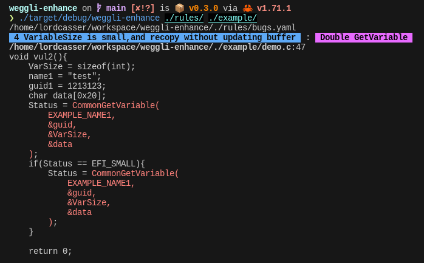

# weggli-enhance



## Why weggli-enhance

- **Feature enhance:** support yaml multi-pattern input @[issue 76](https://github.com/weggli-rs/weggli/issues/76)
- **Accuracy enhance:** corrent fix some wild-query bugs
- **Cross Platform: ** support Win\Mac\Linux

I hope to continue **enhance** weggli. And this project will remain active for a long time to come.


## Introduction (for weggli)
weggli is a fast and robust semantic search tool for C and C++ codebases.
It is designed to help security researchers identify interesting functionality in large codebases.

weggli performs pattern matching on Abstract Syntax Trees based on user provided queries. Its query language
resembles C and C++ code, making it easy to turn interesting code patterns into queries.

weggli is inspired by great tools like [Semgrep](https://semgrep.dev/), [Coccinelle](https://coccinelle.gitlabpages.inria.fr/website/), [joern](https://joern.readthedocs.io/en/latest/) and [CodeQL](https://securitylab.github.com/tools/codeql), but makes some different design decisions:

- **Minimal setup**: weggli should work *out-of-the box* against most software you will encounter. weggli does not require the ability to build the software and can work with incomplete sources or missing dependencies.

- **Interactive**: weggli is designed for interactive usage and fast query performance. Most of the time, a weggli query will be faster than a grep search. The goal is to enable an interactive workflow where quick switching between code review and query creation/improvement is possible.

- **Greedy**: weggli's pattern matching is designed to find as many (useful) matches as possible for a specific query. While this increases the risk of false positives it simplifies query creation. For example, the query  `$x = 10;` will match both assignment expressions (`foo = 10;`) and declarations (`int bar = 10;`).

- **C++ support (Temporarily not supported due to cross-platform reasons)**: weggli has first class support for modern C++ constructs, such as lambda expressions, range-based for loops and constexprs.


## Usage
```
Use -h for short descriptions and --help for more details.
 
 Homepage: https://github.com/LordCasser/weggli
 
 USAGE: weggli-enhance [OPTIONS] <RULES> <PATH>
 
 ARGS:
     <RULES>    
            A weggli search pattern. weggli's query language closely resembles
             C and C++ with a small number of extra features.
             
             For example, the pattern '{_ $buf[_]; memcpy($buf,_,_);}' will
             find all calls to memcpy that directly write into a stack buffer.
             
             Besides normal C and C++ constructs, weggli's query language
             supports the following features:
             
             _        Wildcard. Will match on any AST node. 
             
             $var     Variables. Can be used to write queries that are independent
                      of identifiers. Variables match on identifiers, types,
                      field names or namespaces. The --unique option
                      optionally enforces that $x != $y != $z. The --regex option can
                      enforce that the variable has to match (or not match) a
                      regular expression.
             
             _(..)    Subexpressions. The _(..) wildcard matches on arbitrary
                      sub expressions. This can be helpful if you are looking for some
                      operation involving a variable, but don't know more about it.
                      For example, _(test) will match on expressions like test+10,
                      buf[test->size] or f(g(&test));
             
             not:     Negative sub queries. Only show results that do not match the
                      following sub query. For example, '{not: $fv==NULL; not: $fv!=NULL *$v;}'
                      would find pointer dereferences that are not preceded by a NULL check.
            
            strict:   Enable stricter matching. This turns off statement unwrapping and greedy
                      function name matching. For example 'strict: func();' will not match
                      on 'if (func() == 1)..' or 'a->func()' anymore. 
             
             weggli automatically unwraps expression statements in the query source 
             to search for the inner expression instead. This means that the query `{func($x);}` 
             will match on `func(a);`, but also on `if (func(a)) {..}` or  `return func(a)`. 
             Matching on `func(a)` will also match on `func(a,b,c)` or `func(z,a)`. 
             Similarly, `void func($t $param)` will also match function definitions 
             with multiple parameters. 
             
             Additional patterns can be specified using the --pattern (-p) option. This makes
             it possible to search across functions or type definitions.
             
    <PATH>     
            Input directory or file to search. By default, weggli will search inside 
             .c and .h files for the default C mode or .cc, .cpp, .cxx, .h and .hpp files when
             executing in C++ mode (using the --cpp option).
             Alternative file endings can be specified using the --extensions=h,c (-e) option.
             
             When combining weggli with other tools or preprocessing steps, 
             files can also be specified via STDIN by setting the directory to '-' 
             and piping a list of filenames.
             
 
 OPTIONS:
    -A, --after <after>                 
            Lines to print after a match. Default = 5.

    -B, --before <before>               
            Lines to print before a match. Default = 5.

    -C, --color                         
            Force enable color output.

        --exclude <exclude>...          
            Exclude files that match the given regex.

    -e, --extensions <extensions>...    
            File extensions to include in the search.

    -f, --force                         
            Force a search even if the queries contains syntax errors.

    -h, --help                          
            Prints help information.

        --include <include>...          
            Only search files that match the given regex.

    -l, --limit                         
            Only show the first match in each function.

    -n, --line-numbers                  
            Enable line numbers

    -u, --unique                        
            Enforce uniqueness of variable matches.
             By default, two variables such as $a and $b can match on identical values.
             For example, the query '$x=malloc($a); memcpy($x, _, $b);' would
             match on both
             
             void *buf = malloc(size);
             memcpy(buf, src, size);
             
             and
             
             void *buf = malloc(some_constant);
             memcpy(buf, src, size);
             
             Using the unique flag would filter out the first match as $a==$b.
             
    -v, --verbose                       
            Sets the level of verbosity.

    -V, --version                       
            Prints version information.
```

## Examples
Calls to memcpy that write into a stack-buffer:

```c
weggli '{
    _ $buf[_];
    memcpy($buf,_,_);angular2html
}' ./target/src
```

Calls to foo that don't check the return value:
```c
weggli '{
   strict: foo(_);
}' ./target/src
```

Potentially vulnerable snprintf() users:
```c
weggli '{
    $ret = snprintf($b,_,_);
    $b[$ret] = _;
}' ./target/src
```

Potentially uninitialized pointers:
```c
weggli '{ _* $p;
NOT: $p = _;
$func(&$p);
}' ./target/src
```

Potentially insecure WeakPtr usage:
```cpp
weggli --cpp '{
$x = _.GetWeakPtr(); 
DCHECK($x); 
$x->_;}' ./target/src
```

Debug only iterator validation:
```cpp
weggli -X 'DCHECK(_!=_.end());' ./target/src
```

Functions that perform writes into a stack-buffer based on
a function argument.
```c
weggli '_ $fn(_ $limit) {
    _ $buf[_];
    for (_; $i<$limit; _) {
        $buf[$i]=_;
    }
}' ./target/src
```

Functions with the string decode in their name
```c
weggli -R func=decode '_ $func(_) {_;}'
```

Encoding/Conversion functions
```c
weggli '_ $func($t *$input, $t2 *$output) {
    for (_($i);_;_) {
        $input[$i]=_($output);
    }
}' ./target/src
```

## Install

```sh
$ cargo install weggli
```

## Build Instruction

```sh
# optional: install rust
curl --proto '=https' --tlsv1.2 -sSf https://sh.rustup.rs | sh 

git clone https://github.com/googleprojectzero/weggli.git
cd weggli; cargo build --release
./target/release/weggli
```


## Hacking Weggli (copy from [@carstein](https://github.com/carstein))

This document's goal is to give a high level overview of a weggli - how it works, what are the basic building blocks and how to navigate the source code. We hope that it will help future developers to quickly comprehend main concepts and allow them to either make significant changes in the code or implement new features.

> I might change this document to fit the weggli-enhance, only if I got enough time. —— by LordCasser

### A tree-sitter parser

The most important external library used in weggli is Tree-sitter - a parser generator that combines the ability to transform a source code into an AST (Abstract Syntax Tree) as well as running complex queries against such AST. Knowledge of how to use this library is essential if you want to add new rules or support for new programming languages.

As it was already mentioned - two most important elements of this library is a parser that can turn a source code into an AST and a query language that could find certain patterns inside such AST.

To discover their inner working we can check the example below.

```c
{
  int x = 10;
  void *y = malloc(x);
}
```

If we transform those two C instructions into an AST we would end up with a following one:

```
translation_unit [0, 0] - [4, 0]
  compound_statement [0, 0] - [3, 1]
    declaration [1, 2] - [1, 13]
      type: primitive_type [1, 2] - [1, 5]
      declarator: init_declarator [1, 6] - [1, 12]
        declarator: identifier [1, 6] - [1, 7]
        value: number_literal [1, 10] - [1, 12]
    declaration [2, 2] - [2, 22]
      type: primitive_type [2, 2] - [2, 6]
      declarator: init_declarator [2, 7] - [2, 21]
        declarator: pointer_declarator [2, 7] - [2, 9]
          declarator: identifier [2, 8] - [2, 9]
        value: call_expression [2, 12] - [2, 21]
          function: identifier [2, 12] - [2, 18]
          arguments: argument_list [2, 18] - [2, 21]
            identifier [2, 19] - [2, 20]
```

Now, if we are interested in finding certain patterns in the code we can write a query that looks like this.

```
(
	(declaration (init_declarator value: (call_expression (identifier) @1)))
    (#eq? @1 "malloc")
)
```

Applying this query to aforementioned AST will result in finding a `malloc()` call.

### Life of a query

##### Parameters

The life of a *weggli* query begins when the user provides a set of parameters to the executable. The most important ones are *Pattern* and *Path*. Pattern is an expression in a weggli query language that closely resembles C/C++ with a small number of extra features. *Path* is just a file or directory that we are going to process looking for our pattern. Parameter extraction is happening in `cli::parse_argument()` and it stores all the results in `Args` structure. Besides the already mentioned parameters we are also capturing a lot of supplementary ones. You can find more about them by reading the `src/cli.rs` file.

##### Pattern normalization

User-provided pattern is first sent to a `parse_search_pattern()` function where it is normalized (fixing missing semicolon or lack of curly braces) and validated. After normalization we end up with a tree-sitter AST of our pattern represented by a `Tree` type. Validation is happening inside `validate_query()` function and the main objective is to verify if it has no syntax errors and if it is *rooted* correctly. In the absence of error function returns a `TreeCursor` that points to the root node of the AST of a user pattern.

> In weggli a correctly rooted expression means that it has a single root of one of the expected types. So, in normal terms - if this is a single compound statement, function definition or valid `struc`, `enum`, `union` or `class`.

##### Building a weggli query

The real heavy lifting starts when we pass the cursor to a `builder::build_query_tree()` - function responsible for turning our AST into a tree-sitter search query. This query will reside in `QueryTree` - along variables, captures and negations. The important part is that a single user pattern will usually result in a tree of sub-queries. Main reason is tree-sitter query language inability to search iteratively. A typical example would be a nested function calls like `int x = func_1(func_2(buf))` - searching for a `func_1($buf)` would miss the nested calls.

When the `QueryTree` is ready we can put it into a `WorkItem` together with all the defined *identifiers* like function names, variables and types.

> Captures are simply a variables like `$var` that we have defined in our pattern.
>
> Negation is simply a negative query that later on will be used to filter out results that match this particular branch.

##### Dispatch query to workers

When our pattern is finally transformed into a tree of tree-sitter queries and a set of files to be scanned is locked we are ready to start our workers.

We begin with `parse_files_worker()` as our first line of workers. What happens here is that we have a *pool* of threads that process the files we've defined as our target. Processing actually is happening in two steps - in the first step we simply check if the file in a *raw* form contains any of the identifiers we are interested in. If this is not the case then this file is skipped, otherwise it is transformed into an AST using again a tree-sitter parser and sent to the second line of workers via an established mpsc channel.

The `execute_queries_worker()` function starts second line workers. Their main task is to recivce an AST of the target files and apply a set of queries from the `WorkItem` to them.

The whole process of running a query against given AST is happening in multiple stages as well and the starting point is `QueryTree.match_internal()` and some more stages that follows usually involve filtering out duplicates and enforcing some limit.

In case we were running multiple queries there is also a third line worker spawned by `multi_query_worker()` function. Main job of this worker is to capture all independent results to filter them looking if variable assignments are valid for all the queries. Regardless if we have gone through the last line of workers or not we end up with an array of `QueryResult` objects that represent all our findings.

##### Displaying results

Each of the `QueryResult` objects has a `display()` method that is responsible for printing the results. It always prints out the found node and surrounding lines of code to the console - at least for now. The function also tries to merge multiple different findings into one where applicable (for example if there are two findings in the same function).

## Implementation details

Weggli is built on top of the [`tree-sitter`](https://tree-sitter.github.io/tree-sitter/) parsing library and its [`C`](https://github.com/tree-sitter/tree-sitter-c) and [`C++`](https://github.com/tree-sitter/tree-sitter-cpp) grammars.
Search queries are first parsed using an extended version of the corresponding grammar, and the resulting `AST` is
transformed into a set of tree-sitter queries
in `builder.rs`.
The actual query matching is implemented in `query.rs`, which is a relatively small wrapper around tree-sitter's query engine to add weggli specific features.

## License

Apache 2.0; see [`LICENSE`](LICENSE) for details.

